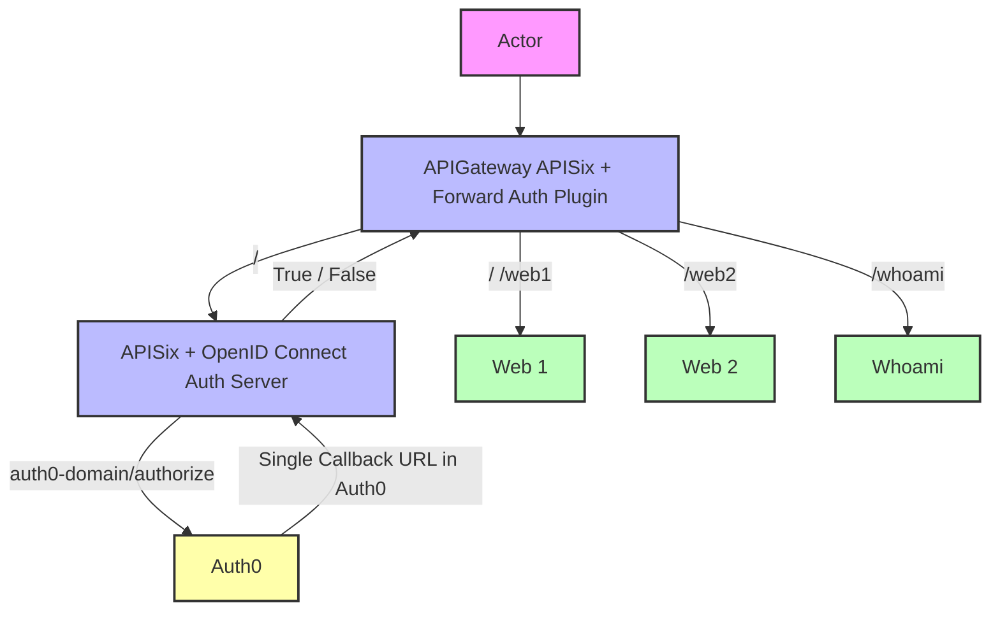

# APISIX as Forward Auth Server with OpenID Connect

> A comprehensive solution implementing Apache APISIX as a forward authentication server with OpenID Connect (OIDC) integration, enabling secure single sign-on (SSO) for multiple downstream services.

[](https://opensource.org/licenses/MIT)
[](https://www.docker.com/)
[](https://apisix.apache.org/)

## 🏗️ Architecture Overview



## 🌟 Features

- **Single Callback URL**: Need to setup only one callback URL in the identity provider for multiple services
- **OpenID Connect Integration**: Complete OIDC flow with Auth0 support for authentication
- **Forward Authentication**: Implements the forward auth pattern with APISIX for all protected services
- **Session Management**: Secure session handling with configurable parameters
- **Multi-Service Protection**: Protects multiple downstream services with a single authentication point
- **Header Propagation**: Forwards authentication context to upstream services
- **Docker Compose Setup**: Easy deployment with Docker Compose
- **Enhanced Logging**: Configurable logging for debugging and monitoring

## 🚀 Quick Start

### Prerequisites

- Docker and Docker Compose
- Auth0 account (or any OIDC-compatible provider)
- Domain name or localhost setup

### Environment Setup

1. **Clone the repository**
   ```bash
   git clone https://github.com/arulrajnet/apisix-as-forward-auth.git
   cd apisix-as-forward-auth
   ```

2. **Configure environment variables**

   Key variables to set:
   ```env
   SERVER_DOMAIN=localhost
   IDP_CLIENT_ID=your-client-id
   IDP_CLIENT_SECRET=your-client-secret
   IDP_AUDIENCE=your-audience
   IDP_DOMAIN=your-auth0-domain.auth0.com
   SESSION_SECRET=your-random-session-secret
   ```

3. **Start the services**
   ```bash
   docker-compose up -d
   ```

4. **Access the application**
   - Main gateway: `https://localhost`
   - Auth callback: `https://localhost/callback`
   - Logout: `https://localhost/logout`

## 🔧 Configuration Deep Dive

### Forward Auth Plugin

- **Custom Headers**: Forwards authentication headers to upstream services
- **Error Handling**: Graceful degradation on auth service failures
- **SSL Verification**: Configurable SSL verification for auth requests
- **Request Method Support**: GET/POST support for auth requests

### OpenID Connect Configuration

The auth server (`auth_apisix/apisix.yaml`) is configured with:

- **Session Management**: Secure cookie-based sessions
- **Token Refresh**: Automatic token refresh handling
- **Multi-Header Support**: Forwards user info, tokens, and claims

### Services Protected

The setup protects multiple services:

1. **Web1** (`/web1/*`) - Nginx-based web application
2. **Web2** (`/web2/*`) - Secondary web application
3. **Whoami** (`/whoami/*`) - Traefik whoami service for testing
4. **Root** (`/*`) - Default route protection

## 🛠️ Key Learnings from Development

Based on the commit history, here are the important learnings and evolution of the project:

### 1. **To browser sends cookie both apisix has to be in same domain**
- **Initial Challenge**: Browser cookie sharing between main APISIX gateway and auth APISIX instance failed due to different domain configurations
- **Solution**: Configured both APISIX instances to use the same `${{SERVER_DOMAIN}}` and set proper cookie domain in session configuration
- **Learning**: For forward auth to work properly, both the main gateway and auth server must be accessible from the same domain so cookies can be shared between them

### 2. **Proper headers passed from main gateway to auth server (request_headers)**
- **Initial Challenge**: Callback returns 500 error with the message "the error request to the redirect_uri path, but there's no session state found"
- **Solution**: Need to send the `Host` and `User-Agent` headers from the main APISIX gateway to the auth APISIX instance
- **Learning**: The hosts is configured in the routes of auth APISIX, so the `Host` header must match for proper routing. The `User-Agent` header is also required by `resty-session`, It's used to identify the client session. Refer [resty-session code](https://github.com/bungle/lua-resty-session/blob/v3.10/lib/resty/session.lua#L591)

### 3. **Proper headers passed from auth server to browser (client_headers)**
- **Initial Challenge**: Too many redirects when accessing protected routes before login.
- **Solution**: The initial state session is not passed to browser from the auth APISIX instance.
- **Learning**: Added `Set-Cookie` header in the `client_headers` of forward auth plugin configuration in main APISIX gateway to pass the session cookie to browser.

### 4. **Large Header Handling**
- **Challenge**: Authentication responses with large headers (JWT tokens, user info)
- **Solution**: Added nginx proxy buffer configuration in `apisix/config.yaml`
- **Configuration**:
  ```yaml
  proxy_buffers 4 10m;
  proxy_buffer_size 10m;
  proxy_busy_buffers_size 10m;
  ```

### Debug Mode

Enable debug logging by setting:
```env
LOG_LEVEL=debug
```

## 🧪 Testing

Test the setup with different scenarios:

1. **Protected Routes**: Access `/web1`, `/web2`, `/whoami`
2. **Authentication Flow**: Test login/logout cycle
3. **Header Propagation**: Check if auth headers reach upstream services
4. **Token Refresh**: Test with expired tokens

## 🔄 Service Flow

1. **User Request** → APISIX Gateway
2. **Forward Auth Check** → Auth APISIX instance
3. **OIDC Validation** → Identity Provider (Auth0)
4. **Session Management** → Secure cookie storage
5. **Header Injection** → User context to upstream
6. **Response** → Protected service content

## 🐳 Docker Services

| Service | Purpose | Port | Image |
|---------|---------|------|-------|
| `apisix` | Main gateway | 80, 443 | apache/apisix:3.14.1-debian |
| `auth_apisix` | Auth server | 9080 | apache/apisix:3.14.1-debian |
| `web1` | Test web app | 80 | nginx:1.29.2-alpine |
| `web2` | Test web app | 80 | nginx:1.29.2-alpine |
| `whoami` | Debug service | 80 | traefik/whoami:v1.11.0 |

## 📝 License

This project is licensed under the MIT License - see the [LICENSE](LICENSE) file for details.


## 📚 Additional Resources

- [Apache APISIX Documentation](https://apisix.apache.org/docs/)
- [OpenID Connect Specification](https://openid.net/connect/)
- [Forward Auth Pattern](https://doc.traefik.io/traefik/middlewares/http/forwardauth/)
- [Auth0 Documentation](https://auth0.com/docs/)

## Author

<p align="center">
  <a href="https://x.com/arulrajnet">
    
  </a>
  <br>
  <strong>Arul</strong>
  <br>
  <a href="https://x.com/arulrajnet">
    
  </a>
  <a href="https://github.com/arulrajnet">
    
  </a>
  <a href="https://linkedin.com/in/arulrajnet">
    
  </a>
</p>
